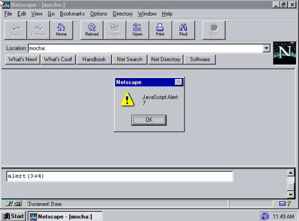
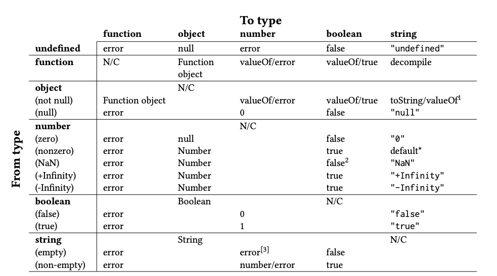

# 第一部分 Javascript 的起源

## 2. 前言

万维网的概念和基础技术是 Tim Berners-Lee 1989–1991 年期间在 CERN（欧洲核子研究中心） 提出的。Berners-Lee 的网络技术在高能物理学界流传了几年。然而，这些技术并没有得到社区外的关注，直到 1992-1993 年，本科生 Marc Andreessen 和在伊利诺伊大学香槟分校国家超级计算应用中心（NCSA）工作的 Eric Bina 开发了 Mosaic，才在社区外引起了很大的关注。

NCSA Mosaic 是一个易于安装、易于使用的 Web 客户端，具有图形用户界面。它从根本上定义了 "网络浏览器 "这一软件类别，并在物理学界之外普及了万维网的概念。Mosaic 被广泛传播，到了 1994 年初，商业利益集团纷纷争先恐后地加入到浏览器的行列中来，要么拿 NCSA Mosaic 代码授权，要么从头开始开发受 Mosaic 启发的浏览器。Silicon Graphics 公司的创始人 Jim Clark，获得了风险投资资金，并招募了 Marc Andreessen 和 Eric Bina。1994 年 4 月，他们共同创立了这家公司，并最终命名为 Netscape 通讯公司。Netscape 公司的目标是取代 NCSA Mosaic 成为世界上最受欢迎的浏览器。它从零开始开发了一个类似于 Mosaic 的下一代增强型浏览器，并于 1994 年 10 月开始广泛发行。到 1995 年年初，Netscape Navigator 已经实现了最初的目标，并迅速取代了 Mosaic。

Tim Berners-Lee 的 Web 技术是围绕着使用声明性的 HTML 标记语言来描述文档作为网页的表现形式。与之相对的是，业界对使用脚本语言产生了相当大的兴趣，脚本语言使终端用户能够编排应用程序的操作。诸如 Office，Visual Basic 和 AppleScript 等语言并不是为了实现主应用程序的核心部分的复杂数据结构和算法组件，相反，它们为用户提供了一种以新奇的方式将这些应用组件粘合在一起的方法。随着 Netscape 扩大了万维网的受众范围，一个重要的问题是，是否应该以及如何将脚本集成到网页中。

### 2.1 Brendan Eich 加入 Netscape

Brendan Eich 1985 年硕士毕业于 UIUC 后，前往 Silicon Graphics, Inc 工作。他最初主要致力于 Unix 内核和网络层的工作。1992 年，他离开了 SGI 加入了 MicroUnity，一家资金雄厚的初创公司，开发视频媒体处理器。在这两家公司他都为支持内核和网络编程任务实现了小型特殊用途语言。在 MicroUnity 的时候，他还做了一些 GCC 编译器的工作。

1995 年初，Brendan Eich 被“来做浏览器中的 Scheme(一种语言)”口号所吸引，加入了网景公司。但当 Eich 于 1995 年 4 月 3 日加入网景公司时，他发现了他发现了复杂产品的时长和编程语言的解决方案。1994 年底，网景公司曾拒绝了微软的低价收购要约，此后，网景公司管理层期望通过微软的 "拥抱、扩展、扩展、消灭 "战略直接出击。在比尔-盖茨的直接领导下，微软很快就意识到，随着 Web 作为跨 OS 平台的崛起，其即将推出的专有墙面信息实用程序 Project Blackbird 将变得无关紧要。盖茨的“互联网浪潮”备忘录将微软从黑鸟重新推向了 Internet Explorer 和全套服务器产品，因为 Netscape 急于在相同的市场上争夺利益。

网络脚本语言的候选语言包括诸如 Scheme 的研究型语言、诸如 Prel, Python 和 Tcl 等基于 Unix 的使用语言和微软的 Visual Basic。Brendan Eich 曾期望在浏览器中实现 Scheme。但在 1995 年初，Sun Microsystems 公司为其尚未发布的 Java 语言开展了一场游击营销活动。Sun 和 Netscape 公司很快就达成了协议，将 Java 集成到 Netscape 2 中。Eich 回忆说，Marc Andreessen 在 Netscape 会议上提出的口号是 "Netscape 加 Java 会杀死 Windows"。1995 年 5 月 23 日，在 Sun 公司公开宣布 Java 的时候，Netscape 宣布有意授权 Sun 公司的 Java 技术在浏览器中使用。

由于商业利益和/或市场化时间的考虑，Netscape 内部迅速制定了战略，选择脚本语言，而没有选择 Scheme、Perl、Python、Tcl 和 Visual Basic。Netscape 和 Sun 公司的高级管理人员，特别是 Marc Andreessen 和 Sun 公司的 Bill Joy 认为唯一可行的方法是设计和实现一种“小语言”来补充 Java。

持怀疑态度的人在 Sun 占主导地位，而在 Netscape 也占了大多数，它们质疑是否需要一种更简单的脚本语言：Java 不适合脚本吗？是否有可能解释为什么两种语言比一种语言更好？Netscape 公司是否有必要的专业知识来创建一种新的语言。

第一种反对意见很容易被反驳。1995 年春天的时候，Java 还不是一门适合新手的语言。人们不得不将主程序的代码体封装在一个包中的类声明中的一个名为 main 的静态方法中。人们也不得不为所有参数、返回值和变量声明静态类型。基于 Visual BASIC 补充 Visual C ++的经验以及许多 Unix 语言补充基于原生代码(native-code-based)的组件的经验，很明显 Java 对于“胶水”脚本编写者来说还不够简单。

第二种反对意见通过引用微软的产品而被克服。对于专业的 Windows 应用程序员，微软提供了 Visual C++。对于业余爱好者、兼职程序员、设计师、会计师等，微软提供了 Visual Basic 作为脚本语言，让那些经验不足的兼职程序员可以用 Visual C++"粘合"在一起并定制使用 Visual C++构建的组件。Visual Basic 的一个名为 "Visual Basic for Applications "的版本被集成到微软的 Office 应用程序中，以支持用户扩展和编写这些应用程序的脚本。

在克服了前两个反对意见后，Marc Andreessen 提出了浏览器脚本语言的代号 "Mocha"，据 Eich 说，希望在适当的时候将该语言改名为 "JavaScript"。这种与 Java 相伴的语言必须 "看起来像 Java"，同时保持简单易用，"基于对象"，而不是像 Java 那样基于类。

最后的反对意见依然存在：Netscape 公司是否拥有创建有效的脚本语言的专业知识，并为 1995 年 9 月的 Netscape 2 测试版做好了准备？Brendan Eich 的任务是通过创建 Mocha 来证明他们们有这个能力。

### 2.2 Mocha 的故事

随着 Java 发布的临近，Brendan Eich 看到了时间的重要性，他认为多个二鸟在林不如一鸟在手，于是他在 1995 年 5 月用十天的时间完成了第一个 Mocha 的原型实现。这项工作是为了满足可行性演示的最后期限而仓促进行的。该演示包括了最基本的语言实现，并将其最小化集成到 Netscape 2 的 pre-alpha 浏览器中。

Eich 的原型是在 Silicon Graphics Indy Unix 工作站[Netfreak 2019]上开发的。该原型使用了一个手写的词法分析器和递归下降语法分析器。语法分析器生成字节码指令而不是语法树。字节码的转义很简单，速度也很慢

字节码是 Netscape Livewire 服务器的一个必要依赖，其开发人员甚至在 Mocha 还没有原型化之前就指望着嵌入 Mocha。该团队的前 Borland 管理和工程人员是动态脚本语言的忠实拥护者，但他们希望使用字节码，而不是源解析，以加快服务器应用程序的加载速度。

Marc Andreessen 强调 mocha 应该是非常容易编写的语言，任何人都可以直接在 html 文档中写得出几行 mocha。Sun 和 Netscape 的高层管理人员重申了 Mocha“看起来像 Java”的要求，明确排除了任何类似 BASIC 的东西。但是，类似 Java 的外观造成了对类似 Java 的行为的期望，这影响了对象模型的设计和 boolean、int、double 和 string 等“基本类型”的语义。

除了看起来像 Java 之外，Brendan Eich 可以自由选择大部分语言设计细节。在加入 Netscape 之后，他曾探索过“易于使用”或“教学型”语言，包括 HyperTalk、Logo 和 Self。每个人都同意 Mocha 将是 "基于对象的"，但没有类，因为支持类会花费太长的时间，而且有与 Java 竞争的风险。出于对 Self 的钦佩，Eich 选择了从一个动态对象模型开始，使用委托代理和单一原型链的动态对象模型。他认为这样做可以节省实现时间，尽管最终他缺乏足够的时间在 Mocha 原型中暴露出这种机制。

对象是通过将 new 操作符应用到构造函数上来创建的。一个名为 Object 的默认对象构造函数与其他内置对象一起被内置到环境中。每个对象都由 0 个或多个 property 组成。每个 property 都有一个名字（也被叫做 property 的 key）和一个 value，这个 value 可以是一个函数，一个对象或者一个其他内置数据类型的值。property 是通过给一个未使用的 property key 赋值来创建的。property 没有可见性或赋值限制。一个构造函数可以提供一个初始 property 集合。在对象创建后，可以向其添加额外的属性。这种非常动态的方法特别受到 LiveWire 团队的青睐。

尽管做 Scheme 的诱惑已经消失，但 Brendan Eich 仍然觉得 Lisp 中函数是一等公民的概念很有吸引力。没有了类来包含方法，一等公民的函数为受 Scheme 启发的语法提供了一个工具包，顶层程序（TODO 这里不太懂），函数作为值传递，对象中的方法和事件处理程序。由于时间的限制，函数表达式（也叫 lambda 表达式，lambdas）未能实现，但它们在语法中被保留了下来。事件处理程序和对象方法被统一起来，通过引入 从 Java（C++之后）中借用的 this 关键字来表示该函数作为方法被调用的上下文对象。

在与 Marc Andreessen 和一些早期的 Netscape 工程师的非正式讨论的推动下，这个原型支持了 eval 函数，一个解析和执行程序内字符串的功能。直觉上而言，这种动态字符串转程序的编程方式对于一些运行在 web 浏览器上或者服务器上的应用而言是很重要的，但是支持 eval 的决定却带来了直接的后果：有些用户要求函数提供类似于 Java 的 toString 方法将其源代码提供为字符串。Eich 决定在他为期十天的冲刺中实现了一个字节码反编译器，因为源码在内存中存储或是从二级存储中恢复（TODO）对于某些需要支持的目标计算机架构来说似乎成本太高了，对于 Windows 3.1 个人电脑来说尤其如此，因为这些电脑受制于 Intel 8086 16 位段式内存模型，需要叠加和手动管理的多段内存来实现无边界或大的内存结构。

十天结束后，在网景公司全体工程人员的会议上演示了原型（图 2）。这次演示很成功，让人们对定于 9 月发布的 Netscape 2 第一个测试版的发布持过度乐观的态度。Brendan Eich 这个夏天的主要工作重点是将 Mocha 更全面地集成到浏览器中。这需要设计和实现使 Mocha 程序与网页交互的 API。同时，他还必须将该语言的原型实现转化为可交付的软件，并对早期内部用户的错误报告、修改建议和功能请求做出回应。


图 2: Mocha Console。Brendan Eich 最初的 Mocha 演示中，在 SGI Unix 工作站上运行的 Netscape 2 的 pre-alpha 版本的 Mocha Console。同样的 Mocha Console 在 Netscape 2 的生产版中，除了名字之外，基本上没有任何变化。这是 Netscape 2.02 在 Windows 95 上运行的屏幕截图。Mocha 控制台是通过在浏览器地址栏中输入 mocha:来激活的，而在 Netscape 2 的生产版中，这被改为 javascript:，但 mocha:仍然有效。激活控制台会在浏览器中打开一个 2 个 frame 的页面。在下层 frame 的文本框中输入的 Mocha 表达式在上层框架的上下文中被执行。这个例子显示了内置的 alert 函数被调用来显示一个包含表达式的计算值的弹出窗口。最初的演示版本会在弹出窗口中显示 "Mocha Alert"，而不是 "JavaScript Alert"。

关于 Mocha 的 10 天创作的更多细节请参见 Brendan Eich 对这个故事的复述。Mocha 制作版的源代码可以通过互联网存档获得。Jamie Zawinski 的《网景宿舍（TODO dorm）》是对这一时期网景公司作为软件开发者的工作经历的同期记述。

## 3. Javascript1.0 和 1.1

1995 年 12 月 4 日，Netscape 通讯公司和 Sun Microsystems 公司在一份联合新闻稿中宣布了 JavaScript 的诞生。该新闻稿将 JavaScript 描述为 "一种对象脚本语言"，可用于编写脚本，动态地"修改 Java 对象的属性和行为"，它将作为"对 Java 的补充，便于在线应用程序开发"。这两家公司试图在 Java 和 JavaScript 语言之间建立起强大的品牌联系，尽管它们的技术设计只是表面上的相似。这种名称的相似性及其对这两种语言之间密切联系的暗示一直令人十分迷惑。

1995 年 9 月，以"LiveScript"为名的 JavaScript 最初是作为 Netscape Navigator 2.0 的第一个测试版中的一部分向公众开放的。之后又发布了四次测试版，直到 1996 年 3 月发布了支持 JavaScript 1.0 的 Navigator 2.0 正式版。Netscape 企业服务器 2.0 也于 3 月发布，并在其 LiveWire 服务器端脚本组件中包含了 JavaScript 1.0。

JavaScript 只是 Netscape Navigator 的一个相对次要的功能。因此，它的开发受到了整个 Navigator 2.0 计划的限制，在 1995 年 8 月需要锁版本。Javascript1.0 的功能集基本上是对当年 8 月 Mocha 实现中的功能集进行了分类集成（triage）。尽管在整个 Navigator 2.0 发布过程中，Eich 一直在修复最初的 Mocha 实现中的 bug，但相对于所设想的语言设计来说，这个功能集并不完整，并且表现出了各种有问题的 bug 和边界条件。Brendan Eich 在在 1.0 版本发布前不久接受采访时表示，官方将 JavaScript 定位为 Java 的附属品，而且最初发布的时候很仓促：

> BE(Brendan Eich): 我希望其他厂商能够基于我和 Bill Joy 正在研究的规范把它(Javascript)实现。我希望他仍旧很小巧，但却在互联网上无处不在，成为连接 HTML 元素和在其之上操作包括 Java 小程序和其他组件的首选方式。

> BE: ......据我所知，他最常见的用途是让页面更智能，更生动，比如点击一个链接，并且根据一天中的日期加载不同的 URL。

> BE: 隧道的尽头是有光亮的，尽管 Javascript 因为过于单打独斗，导致(Netscape)2.0 包含无数恼人的小 bug，我的希望是所有的大 bug 都有解决方案，我也花了很多时间和开发人员一起寻找 bug 和解决方案。我正在跟进 2.1 版本，修复 bug，增加功能，并努力使 JavaScript 在所有平台上保持一致。我不知道 2.1 版本什么时候会发布，但我敢打赌在明年秋天之前就会发布——我们的动作很快。

Javascript1.0 是一种简单的动态类型语言，支持数值、字符串、布尔值，一等公民的函数和对象数据类型。语法上来看，JavaScript 和 Java 一样，属于 C 语言家族，其控制流语句借鉴了 C 语言，表达式语法包含了大部分 C 语言中的数字运算符。JavaScript 1.0 的源代码通常直接嵌入到 HTML 文件中，但内置库中包含了一个 eval 函数，可以解析和运行以 JavaScript 字符串值编码的 JavaScript 源代码。JavaScript 1.0 是一种非常精简的语言。表 3 总结了一些其中没有的功能，这些功能的遗漏可能会让现代的 JavaScript 程序员感到惊讶。

-   独立的 Array 对象类型
-   正则表达式
-   undefined 的全局绑定
-   typeof, void, delete 操作符
-   do-while 语句
-   try-catch-finally 语句
-   嵌套函数声明
-   函数的.call, .apply 方法
-   原型继承
-   循环垃圾回收
-   Array 字面量
-   Object 字面量
-   === 操作符
-   in, instanceof 操作符
-   switch 语句
-   break/continue 跳转(to label)
-   Function 表达式
-   函数的 prototype 属性
-   对内置原型对象的访问
-   HTML `<script>` 标签的 src 和 attribute

表. 3. JavaScript 1.0 中没有但（在 2010 年）常用的功能。

1996 年初，开始了 "Atlas"[Netscape 1996g]的工作，这就是 1996 年 8 月 Netscape Navigator 3.0 的代码名称。1995 年 8 月 2.0 功能冻结时，Brendan Eich 得以恢复工作。直到 Navigator 3.0 中发布了 JavaScript 1.1[Netscape 1996a,e]，才完成了 JavaScript 的初步定义和开发。以下各节介绍了 JavaScript 1.0/1.1 语言的设计概况。

1996 年初，Atlas 项目开始，这也是 1996 年 8 月 Netscape Navigator 3.0 的代码名称。Brendan Eich 终于得以从 1995 年 8 月 2.0 锁版本中恢复工作。直到 Navigator 3.0 中发布了 JavaScript 1.1，JavaScript 的最初设计和开发才完成。以下各节介绍了 JavaScript 1.0/1.1 语言的设计概况。

### 3.1 Javascript 语法

JavaScript 1.0 的语法直接仿照了 C 语言的语句语法，并在此基础上加入了一些 AWK 的元素。脚本是一串语句和声明。与 C 语言不同的是，JavaScript 的语句并不一定要存在于在函数体内。在 JavaScript 1.0 中，脚本的源代码被嵌入到 HTML 文档中，并被一个`<script></script>`标签所包围。

JavaScript 1.0 中的受 C 语言启发的语句有：表达式语句；if 条件语句；for 和 while 循环语句；break、continue 和 return 语句，并把他们用作非顺序的流程控制；以及语句块，它使得被`{}`包围的语句群能被当作一条语句来使用。if，for 和 while 语句是语句标签或 goto 语句。 JavaScript 1.0 不包含 C 的 do-while 语句和 switch 语句。

在基础的 C 语句之外，JavaScript 1.0 还增加了两条复合语句，用于访问对象数据类型的属性。受 AWK 启发的 for-in 语句可以对对象的 key 进行迭代。在 with 语句的内部，可以如访问已声明的变量一样直接访问指定对象的属性。由于属性可以被动态添加（在语言的后期版本中也可以被删除），可见的变量绑定可以随着 with 语句的执行过程而改变。

JavaScript 声明不遵循 C 语言或 Java 声明的风格。JavaScript 具有动态类型；此外，它没有语言级的类型名作为语法前缀来标示声明。JavaScript 的声明是用关键字前缀来标示的。JavaScript 1.0 有两种形式的声明：函数声明和 var 声明。函数声明的语法是直接从 AWK 中借用的。一个函数声明定义了单个可调用函数的名称、形式参数和语句体。var 声明引入了一个或多个变量绑定，并有选择地给变量赋值。所有的 var 声明都被看作是语句，可以出现在任何语句上下文中，包括块语句中。在 JavaScript 1.0/1.1 中，函数声明只能出现在脚本的顶层，不能包含嵌套的函数声明。一个 var 声明可以出现在函数体中，而且由这些声明定义的变量是函数的内部变量。

与 C 语言不同的是，Javascript1.0 的声明并没有引入块级作用域，在一个函数体内，块内的 var 声明对函数体内部是本地可见的。在函数体外部的块内 var 声明具有全局作用域。在给一个非作用域内函数或没用使用 var 来声明的变量分配变量名时，会隐含地创建一个全局变量。这种行为是一个重要的错误来源，因为错误地输入一个声明变量的名称会悄悄地创建一个新的变量，并拥有错误的变量名。

与传统 C 语言语法的一个重要区别是 Javascript 对语句末尾分好的处理。C 语言将分号作为语句的终结符，而 Javascript 在行尾允许省略分号。这个行为的确切规范没有包含在 JavaScript 1.0 文档中。Netscape 2.0 手册在描述各种 JavaScript 语句形式时，并没有显示分号。它只是说："一条语句可以跨越多行。如果每条语句之间用分号隔开，那么多条语句可以在一行中出现"。 在 JavaScript 手册的代码示例中，无分号的编码风格是标准的，比如以下这些例子：

```javascript
var a, x, y var r = 10
with (Math) {
    a = PI * r * r
    x = r * cos(PI)
    y = r * sin(PI/2)
}
```

在编写 JavaScript 代码时不使用分号的能力被称为自动分号插入（ASI）。ASI 在 JavaScript 程序员中仍然存在争议；有相当一部分程序员仍然喜欢用不使用分号的方式编写代码，而另一部分程序员则希望没有人使用 ASI。

### 3.2 数据类型与表达式

Javascript1.0/1.1 是一门具有五个基本数据类型的动态语言，这五种数据类型分别是：number, string, Boolean, object 和 function。我们所说的“动态类型”是指运行时的类型信息与数据相关而不是与值的容器（如变量）相关。运行时类型检查确保了操作仅仅被应用在其支持的类型上。

Boolean, string 和 number 都是不可变的值。Boolean 类型有两个值，分别叫做 true 和 false。字符串值包含一个 8bit 的字符编码不可变序列。没有对 Unicode 的支持。number 类型由所有可能的 IEEE 754 双精度二进制 64 位浮点值组成，除此之外，也包含了一个规范值 NaN。一些操作对对应于无符号的 32 位整数和有符号的 32 位 2's 补数整数的数字值进行了特殊处理。Mocha 内部对这类整数值使用了一种替代性的表示方式，但只有 number 一种数据类型。

Javascript 中有两种表示“无用”的值。一个是 undefined，未被初始化的变量和是当程序试图访问一个对象的不存在属性的值被设置为特殊值 undefined。在 JavaScript 1.0 中，可以通过声明并访问一个未初始化的变量来访问 undefined。另一个是 null，在期望有对象值的上下文中，值 null 是用来表示 "没有对象"。它是以 Java 的 null 值为模型，它方便了 JavaScript 与使用 Java 实现的对象的集成。纵观其整个历史，这两个相似但明显不同的值的存在给 JavaScript 程序员带来了困惑，许多人不确定何时应该使用其中哪一个。

JavaScript 1.0 的表达式语法是从 C 语言中借鉴过来的，两种语言的的运算符和优先级规则基本相同。其主要区别是指针，类型相关的运算符和单目+操作符。双目+操作符经过了重载，既支持数字相加，也支持字符串的连接。移位和逐位逻辑运算符都是在有符号 32 位 2's 整数补码上进行操作。如果必要的话，操作数会被截断为整数，并以模数的形式减为 32 位的值。`>>`操作符对 32 位整数值进行符号扩展的算术右移。JavaScript 学习 Java 添加了`>>>`操作符，执行无符号右移。

Javascript 1.1 增加了`delete`， `typeof`和`void`操作符。在 Javascript1.1 中，`delete`操作符仅仅能把操作数或者对象属性设为 null。`typeof`操作符返回标示操作数类型的字符串，可能的值在"object"，"function"，"boolean"， "string"，"number"或者一种用来标示对象的是自定义的字符串值之中。令人吃惊的是，`typeof null`返回的是字符串"object"而不是"null"。这可以说是与 Java 一致的，在 Java 中，所有的值都是对象，null 本质上就是 "无对象 "的对象。但 Java 缺少一个与 typeof 类似的操作符，并且使用 null 作为为初始化变量的默认值。根据 Brendan Eich 的回忆，`typeof null`的值是原本 Mocha 实现中的一个抽象泄漏 (Leaky abstraction)的结果，null 的运行时值被编码为与对象值相同的内部标记值，因此 typeof 操作符的实现返回的是 "object"，而不需要任何额外的特殊情况逻辑。这种选择被证明是对 JavaScript 程序员的一大困扰，因为他们通常希望在尝试使用值的属性的之前，先测试一个值是否是一个对象。但是测试一个值的结果是"object"并不足以证明可以访问其属性，因为试图访问 null 的属性会产生一个运行时错误。

`void`操作符仅需访问它的操作数，并且返回 undefined。`void 0`是一个常用的获得 undefined 的方法。 void 操作符的也被引入帮助定义 HTML 超链接，例如，当点击 HTML 超链接时时执行 JavaScript 代码：

```html
<a href="javascript:void usefulFunction()">Click to do something useful</a>
```

href 属性的值应该是一个 URL，在这里`Javascript:`是一种特殊的 URL 协议，能够被浏览器识别。它的意思是将这个值当作 Javascript 代码进行处理、使用它的返回值并将其转换为字符串，正如使用普通的 href URL 获取的响应文档一样。`<a>`元素将尝试处理该文档，除非它是`undefined`的。通常情况下，web 开发者希望在点击链接的时候才会出发 Javascript 表达式的执行。用 void 作为表达式的前缀，可以让他以这种方式使用，并避免了进一步处理`<a>`元素。

C 语言表达式与 Javascript 表达式最大的区别在于，Javascript 操作符在操作符域内自动转换其操作数的数据类型。Javascript1.1 增加了一个可配置的机制，将对象强制转换为数字或者字符串的值。图 4 总结了 Javascript1.1 强制转换规则。



键：

-   两个被`/`分开的结果代表 Javascript 会先尝试第一个，如果不成功的话会使用第二个。
-   N/C：不需要转换。
-   decompile: 包含函数的内部源码的字符串。
-   toString: 调用 toString 方法的结果。
-   valueOf: 调用 valueOf 方法的结果。
-   number：如果字符串是有效的整数或浮点字形，则为数值。

1. 如果 valueOf 不返回字符串，则使用默认的对象-字符串转换。
2. Navigator 3.0 中实现的 JavaScript 1.1 将 NaN 转换为 true。
3. Navigator 3.0 中实现的 JavaScript 1.1 将空字符串转换为 0。

### 3.3 对象

Javascript1.0 中的对象是一种关联数组，其元素被称为“属性”。每个属性都有一个字符串 key 和一个任何类型的 value。属性可以被动态添加。但在 JavaScript 1.0/1.1 中并不支持对象中移除属性。

符合标识符语法的属性字符串 key 可以使用点号访问，`obj.prop0.s`，所有的属性，包含哪些不符合标识符语法的 key，都可以使用方括号来访问，其中方括号包围着一个表达式，该表达式被执行求值，并转换为一个字符串，作为属性的键。例如，当 n 的值为 0 时，`obj["prop "+n]`相当于`obj.prop0`。访问不存在的属性会返回`undefined`，但是，在 JavaScript 1.0/1.1 中，如果使用括号符号访问一个不存在的属性值，并且属性键是一个非负数整数的字符串表示，则返回值 null。

属性既可以作为数据存储，也可以用来与对象关联行为。一个属性的值是一个函数的属性可以被作为对象的方法调用。作为对象的方法调用的函数可以通过关键字 this 的动态绑定来访问对象（§3.7.4）。

对象是通过将 new 操作符应用到内置或用户定义的函数中来创建的。以这种方式使用的函数称为 "构造函数"。构造者通常会给新对象添加属性。这些属性可以是数据存储，也可以是方法。内置的构造函数 Object 可以用来创建一个最初没有属性的新对象。图 5 显示了 Object 构造函数或用户定义的构造函数如何用于创建新对象。

```javascript
//using Object constructor
var pt = new Object();
pt.x = 0;
pt.y = 0;
//using custom constructor
function Point(x, y) {
    this.x = x;
    this.y = y;
}
var pt = new Point(0, 0);
```

图 5：JavaScript 1.0 对象创建可选方法。属性可以在对象创建后添加到对象中，也可以在创建过程中使用自定义构造函数添加到对象中。

JavaScript 1.0 也有一个内置的 Array 构造函数，但是使用 Object 构造函数创建的对象和使用 Array 构造函数创建的对象之间唯一可以观察到的区别是生成的对象显示的调试字符串。由 JavaScript 1.0 的 Array 构造函数创建的对象没有长度属性。

通过使用整数值作为属性键创建属性，可以为任何对象实现类似于数组的索引行为。这样的对象也可以有非整数键的属性:

```javascript
var a = new Object(); //or new Array a[0] = "zero";
a[1] = "one";
a[2] = "two";
a.length = 3;
```

Javascript 1.0 中没有继承的概念，必须得为没有个新对象分别添加所有的属性。这通常是通过为程序使用的每个"类"对象定义一个构造函数来实现的。图 6 显示了一个使用 JavaScript 1.0 编写的简单 Point 抽象的定义。这个例子中需要注意的重要事项如下：

-   每个方法必须被定义为一个全局可见的函数。这些函数的名称必须不可能与其他类抽象（ptSum, ptDistance）的方法函数的名称相冲突。
-   当构造一个对象时，必须为每个方法创建一个对象属性，并将其值初始化为相应的全局函数。
-   方法使用其属性名(origin.distance)而不是全局名(ptDistance)来调用。

```javascript
// 定义可以用作方法的对象
function ptSum(pt2) {
    return new Point(this.x + pt2.x, this.y + pt2.y);
}
function ptDistance(pt2) {
    return Math.sqrt(Math.pow(pt2.x - this.x, 2) + Math.pow(pt2.y - this.y, 2));
}
// 定义Point构造器
function Point(x, y) {
    // 创建并初始化新对象的数据属性
    this.x = x;
    this.y = y;
    // 为每个实例增加方法
    this.sum = ptSum;
    this.distance = ptDistance;
}
var origin = new Point(0, 0); // 创建一个Point对象
```

图 6. 使用 JavaScript 1.0 定义一个抽象 Point。每个实例对象都有自己的方法属性。

JavaScript 1.1 消除了在每个新实例上直接创建方法属性的需要。它通过函数对象的一个名为 prototype 的属性，将一个 prototype 对象与每个构造函数关联起来。JavaScript1.1 指南[Netscape 1996e]将 prototype 描述为"指定类型的所有对象共享的属性"。这是个模糊的描述，可能更好的说法是：一个对象的属性与构造函数创建的所有对象共享。

共享机制就不过多描述了，但可以观察到原型对象的以下特征：

-   当访问对象的属性时，如果这个属性的名称是定义在某个原型上，且原型与对象的构造器相关联，那么将返回这个原型对象上对应的属性。
-   对原型对象上属性的增加或者修改会直接影响到与原型相关联的构造函数创建的已有对象。
-   直接给对象的属性赋值，会使与对象的构造器相关联的原型上的同名属性被隐藏掉。

每一个存在于内置的`Object.prototype`上的属性，除非被对象或者其原型隐藏，都对所有对象是可见的。

```javascript
// 定义可以用作方法的对象
function ptSum(pt2) {
    return new Point(this.x + pt2.x, this.y + pt2.y);
}
function ptDistance(pt2) {
    return Math.sqrt(Math.pow(pt2.x - this.x, 2) + Math.pow(pt2.y - this.y, 2));
}
// 定义Point构造器
function Point(x, y) {
    // 创建并初始化新对象的数据属性
    this.x = x;
    this.y = y;
}
// 为每个实例增加方法
Point.prototype.sum = ptSum;
Point.prototype.distance = ptDistance;
var origin = new Point(0, 0); // 创建一个Point对象
```

图 7. 使用 JavaScript 1.1 定义一个抽象 Point。实例对象可以从`Point.prototype`对象继承方法，而不是在每个实例中都定义该方法。

图 7 展示了一个与图 6 相同，用 Javascript1.1 写的简单 Point 的抽象定义，他们的区别是 Javascript1.1 中的方法只在原型对象中定义了一次，而不是在实例对象的构造器中重复定义。作为对象的原型属性的原型被称作继承原型。直接被定义在对象上的属性被称作自有属性，自有属性会隐藏其他同名属性。

原型对象的属性通常是方法。在这种情况下，构造函数提供的原型的作用与 C++的 vtable 或 Smalltalk 的 MethodDictionary 相同——它将共同的行为与一组对象关联起来。构造器本质上是为类对象服务的，它的原型是类的实例共享方法的容器。这是对 JavaScript 1.1 的对象模型的合理解释，但不是唯一的解释。

构造者原型属性的命名明显暗示了 Brendan Eich 心中的另一个对象模型。该模式的灵感来源于 Self 编程语言，在 Self 中，通过部分克隆某些类别对象的原型对象来创建一个新对象。每个克隆体都有一个父链接回原型，这样，原型就可以提供其所有克隆体共同的功能。JavaScript 1.1 对象模型可以看成是 Self 模型的一个变体，其中原型对象通过构造函数间接访问原型对象，new 操作符从原型中克隆新的实例。 克隆实例继承了原型对象的属性，作为共同的共享属性。 一些 JavaScript 程序员将这种机制称为 "原型继承"。它是一种委派的形式。有些 JavaScript 程序员还用 "经典继承 "这个双关语来指代 Java 和许多其他面向对象语言中使用的继承风格。

JavaScript 1.1 文档并没有完全描述这两种对象模型。它保持了与 1995 年 12 月 Netscape/Sun 新闻稿一致的营销思路。 JavaScript 被定位为对象交互的脚本语言，而对象抽象的实际定义（类定义）将用 Java 编写。原生的 JavaScript 对象抽象能力有限，被定为次要功能，这些功能引起的关注度极低，而且基本上没有被记录在案。

### 3.4 Function 对象

在 Javascript1.0 和 1.1 中，函数的定义创建并给一个可调用的函数命名。这个对函数的命名定义了一个全局变量，类似于顶层代码中的 var 声明。它的值是函数对象，这个值可以被赋给变量，可以作为属性值，也可以在函数调用中作为参数传递，或从函数中返回值。因为函数也是对象，所以可以在函数上定义属性，下面的例子显示了如何将属性添加到函数对象上。

```javascript
function countedHello() {
    alert("Hello , World!");
    countedHello.callCount++; // 增加函数的callCount属性
}
countedHello.callCount = 0; //计数器关联 函数并初始化
for (var i = 0; i < 5; i++) countedHello();
alert(countedHello.callCount); // 5
```

函数的声明伴随着一个正式的参数列表，但是这个参数列表的长度并不限制调用函数时可以传递的参数数量。如果一个函数被调用的参数数少于其声明的参数数，那么额外的参数被设置为 undefined，如果一个函数被调用的参数数多于正式参数，则额外的参数会被赋值，但它们的值不能通过参数名获得。在执行函数主体的过程中，一个类似于数组的 arguments 对象可以作为函数对象的参数属性的值。在调用函数时传递给函数的所有实际参数都可以作为 arguments 对象的整数键属性。这样就可以编写一个可以处理可变长度的参数列表的函数。

### 3.5 内置库

Javascript1.0 自带了一个内置函数、对象和构造器的库，该库定义了一些“通用”对象和函数，同时还定义了许多“host 专用”的对象和函数。对于 Netscape Navigator，host 对象提供了当前 HTML 文档的部分模型。这些 API 最终被称为文档对象模型（DOM）0 级。对于 Netscape Enterprise Server，host 对象支持客户机/服务器通信，管理客户机和服务器会话的状态，以及文件和数据库访问。服务器主机对象的这种设计并没有在 Netscape 服务器产品之外获得采用。

JavaScript 的早期设计主要是由浏览器平台的需求驱动的。早期的 JavaScript 版本的 Netscape 文档并没有明确区分库中的元素是独立于主机环境还是依赖主机的。然而，DOM 和其他浏览器平台 API 的设计、演进和标准化，构成了它自己的重要故事，值得我们自己的历史。本文只在与 JavaScript 的整体设计相关时才会提到浏览器相关的问题。

JavaScript 1.0 只有两个通用对象类，String 和 Date。除此之外，还有一个单例的全局对象 Math，其属性是常用的数学常数和函数。几个未使用或不完全实现的类的构造函数也可以被知道如何访问的 JavaScript 1.0 程序观察到。JavaScript 1.1 完成了这些特性的实现，并记录了它们的存在。图 8 总结了 JavaScript 1.0 和 1.1 中定义的与 host 无关的类。

| 基础对象             | 1.0 属性                                                                                                                                                                                                                                             | 1.1 新增属性                                                                                                                                       |
| :------------------- | :--------------------------------------------------------------------------------------------------------------------------------------------------------------------------------------------------------------------------------------------------- | :------------------------------------------------------------------------------------------------------------------------------------------------- |
| 1.0 1.1              |                                                                                                                                                                                                                                                      |                                                                                                                                                    |
| <全局函数>           | eval, isNaN^1, parseFloat^2, parseInt^2                                                                                                                                                                                                              |                                                                                                                                                    |
| Array^3 Array        |                                                                                                                                                                                                                                                      | join, reverse, sort, toString                                                                                                                      |
| Boolean^3 Boolean    |                                                                                                                                                                                                                                                      | toString                                                                                                                                           |
| Date                 | getDate, getDay, getHours, getMinutes, getMonth, getSeconds, GetTime, getTimezoneOffset, getYear, setDate, setHours, setMinutes, setMonth, setSeconds, setTime, setYear, toGMTString, toLocaleString, Date.parse, Date.UTC arguments, length, caller | toString                                                                                                                                           |
| <函数对象>           | arguments, length, caller                                                                                                                                                                                                                            |                                                                                                                                                    |
| Function^3 Function3 |                                                                                                                                                                                                                                                      | prototype, toString                                                                                                                                |
| Math                 | E, LN2, LN10, LOG2E, LOG10E, PI, SQRT1_2, SQRT2, abs, acos, asin, atan, ceil, cos, exp, floor, log, max,                                                                                                                                             | 1 min,pow,random, round,sin,sqrt,                                                                                                                  |
| tan                  |
| Object               |                                                                                                                                                                                                                                                      | constructor, eval, toString, valueOf                                                                                                               |
| Number^3 Number3     |                                                                                                                                                                                                                                                      | constructor, eval, toString, valueOf toString, Number.NaN, Number.MAX_VALUE, Number.MIN_VALUE, Number. NEGATIVE_INFINITY, Number.POSITIVE_INFINITY |
| <字符串值>           | length                                                                                                                                                                                                                                               |                                                                                                                                                    |
| String               | charAt^4, indexof, lastIndexOf, split^3, substring, toLowerCase, toUpperCase, 和 13 个 HTML wrapper 函数                                                                                                                                             | split, toString, valueOf                                                                                                                           |

1. 在 1.0 中，只在 unix 平台上可用
2. 在 1.0 中，在不同操作系统上的行为不一致
3. 在 1.0 版本中存在，但无法操作或存在 bug。
4. 在 1.0 中，这些方法似乎是字符串值的属性。在 1.1 中，它们是 String.prototype 的属性。

String 类提供了长度属性和 6 个通用方法，这些方法对不可变字符串值进行操作嘛，并适时返回新的字符串值。JavaScript 1.0 字符串类还包括 13 个方法，用于用各种 HTML 标签包装字符串值。这是 JavaScript 1.0/1.1 中主机相关的功能和通用功能之间边界的一个例子。JavaScript 1.0 没有提供全局的 String 构造函数。这是 JavaScript 1.0/1.1 中依赖主机的功能和通用功能之间边界的一个例子。JavaScript 1.0 没有提供全局的 String 构造函数。所有的字符串值，都是通过字符串字面量或内置函数创建的，JavaScript 1.1 增加了全局的 String 构造函数和 split 方法。

Date 类用于展示日历日期和时间。Javascript1.0 的 Date 直接借鉴了 Java1.0 的 Date 类，包括 bug 和其他的一切。包括了一些编码细节如使用以 1970 年 1 月 1 日格林尼治标准时间 00:00:00 为中心的毫秒精度时间值，编号为 0-11 的月份，以及 Java 设计中存在的 2000 年模糊性。这种设计选择的动机是 Java 互操作性的要求。被排除在外的 Java 方法有 equals、before 和 after，这些方法是不需要的，因为 JavaScript 的自动类型转换允许其数字关系运算符直接用于 Date 对象。
